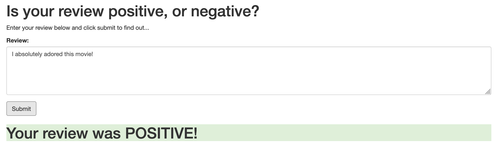
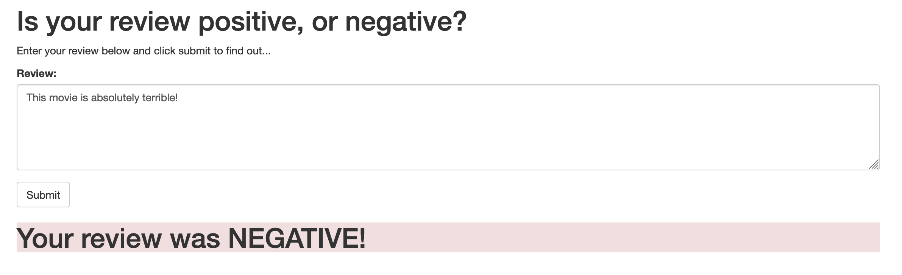
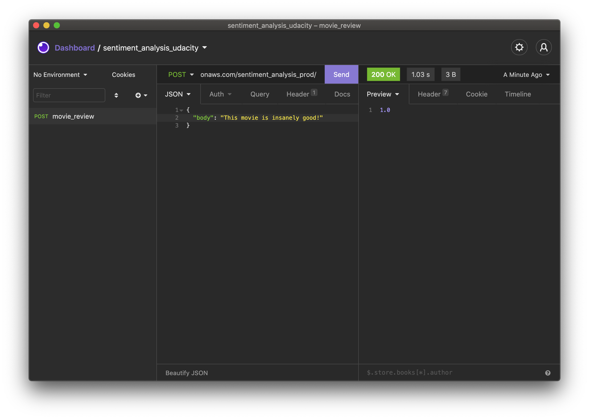
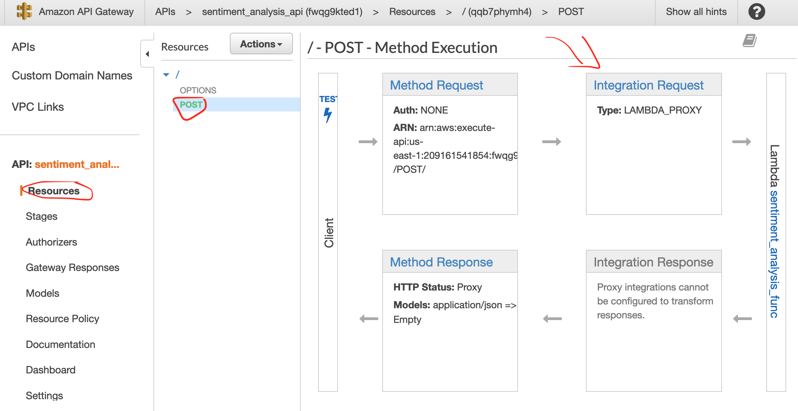
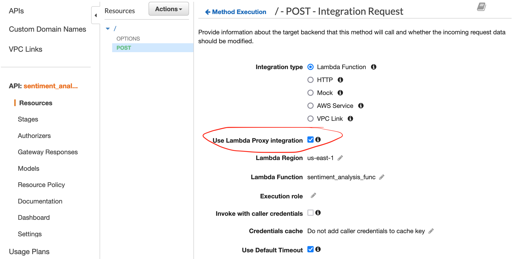

# Training and Deploying a Sentiment Analysis PyTorch and Hugging Face Models in Amazon SageMaker

Training and deploying sentiment analysis models with deep learning using Amazon SageMaker. A BERT model was trained using distributed training with the help of Hugging Face.

Here's the simple web app that sends a request to the deployed model and returns the sentiment of the text:

## Notes Regarding the Project

### Information regarding our Webapp, API Gateway, and Lambda

While trying to get our webapp to work, I ran into some issues when it came to sending the post request and receiving a prediction for our input review. It worked perfectly with Insomnia (similar to Postman), but it was not working at all in the index file.

One of the things I needed to do was to install a CORS web browser extension so that the API could be accessed from the browser. After trying many things with the index file, but I kept getting either 400 Error or 415 Error.

When I was outputting the "result" in index.html to the console, I get NaN.

Anyway, the issue was resolved by ticking the "Use Lambda Proxy integration" in API Gateway "POST - Integration Request" page.

Unfortunately, this is may not be the ideal fix because Insomnia did not need this to work. I'd prefer to understand how to make it work without ticking the box. If you don't tick the box, you can scroll down and find "Mapping Templates." I believe this is either what I need to fix OR I need to modify the index.html file to send the appropriate post request (matching json format). I think it should be related to the latter, but I'm going to move forward with the course for now.

